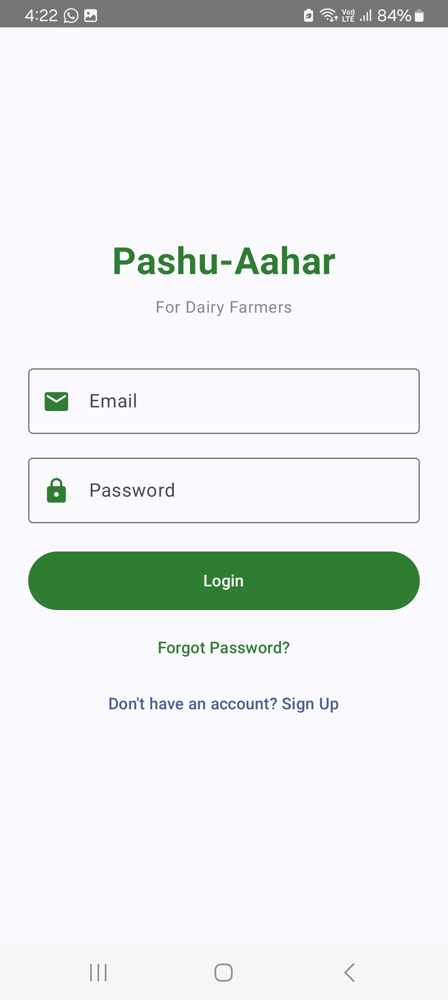
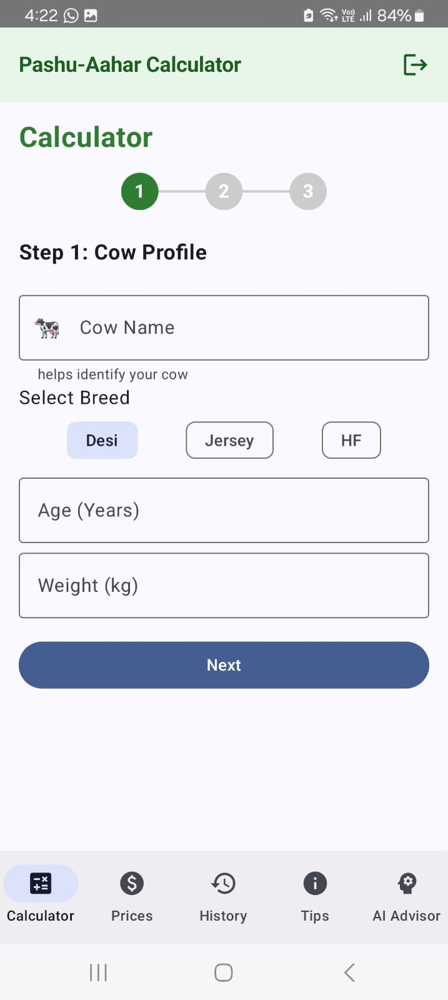
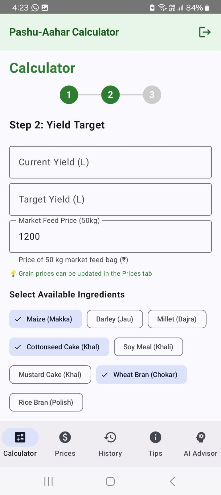
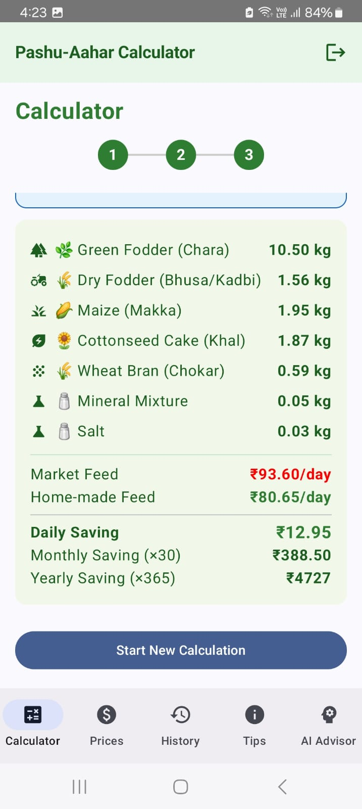
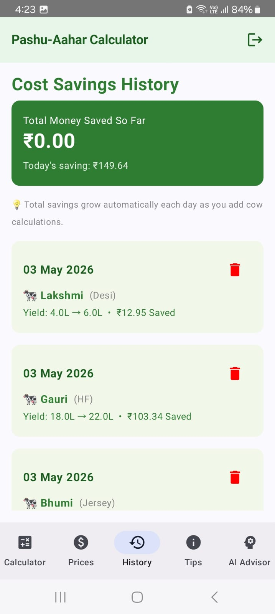
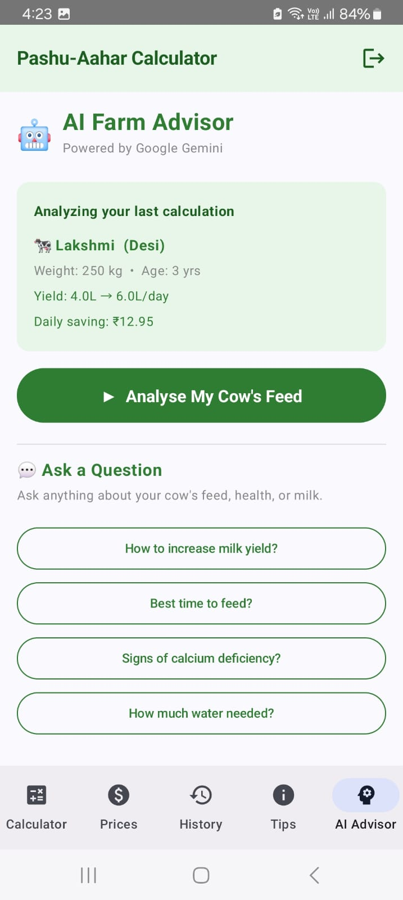

# 🐄 PashuAahar
> Smart Cattle Nutrition & Feed Optimization Application for Dairy Farmers

PashuAahar is an intelligent Android application developed to help Indian dairy farmers optimize cattle feed, reduce feeding costs, and improve milk production using scientific nutrition calculations and AI-powered guidance.

The application generates balanced feed recommendations based on cattle breed, age, weight, and milk yield. It also provides cost comparison between homemade and market feed, helping farmers make economical and healthy feeding decisions.

---

## 🚀 Features

### 1. Balanced Feed Calculator
- **Scientific Rations:** Calculates precise feed requirements (Dry Matter, Crude Protein, TDN) based on cattle breed (Desi, Jersey, HF), age, weight, and milk yield.
- **Ingredient Optimization:** Allows farmers to select available local ingredients (Maize, Cottonseed Cake, Wheat Bran, etc.) to generate a custom recipe.
- **Cost Savings Analysis:** Compares the cost of home-made feed against market-bought feed, showing daily, monthly, and yearly savings.

### 2. AI Farm Advisor (Powered by Google Gemini)
- **Automated Assessment:** Analyzes the latest feed calculations to provide a 4-point report: Feed Assessment, Top 3 Tips, Health Alerts, and Cost Advice.
- **Farming Chatbot:** A dedicated chat interface where farmers can ask questions about cattle health, hygiene, and milk production in both English and Kannada.

### 3. Prosperity Tracker & History
- **Local & Cloud Sync:** Uses Room Database for offline access and Firebase Firestore for cloud backup/sync.
- **Savings History:** Tracks total money saved over time, helping farmers see the economic impact of balanced feeding.

### 4. Market Price Manager
- Allows farmers to update local market prices for various grains and cakes to ensure cost calculations remain accurate.

### 5. Veterinary Tips & Education
- Provides essential tips on balanced diets, clean water, shed hygiene, and vaccination schedules.

### 6. Bilingual Support 🇮🇳
- Full support for **English** and **Kannada** — making the app accessible to local farmers.

---

## 🛠 Tech Stack

| Layer | Technology |
|---|---|
| Language | Kotlin |
| UI Framework | Jetpack Compose (Material 3) |
| Architecture | Single-Activity with Compose Navigation |
| Local Database | Room Database |
| Cloud Database | Firebase Firestore |
| Authentication | Firebase Auth |
| AI Integration | Google Gemini 2.5 Flash API |
| Background Tasks | WorkManager |
| Charts | MPAndroidChart |
| Build System | Gradle (Kotlin DSL) |

---

## 📁 Project Structure

```
Pashu-Aahar/
├── app/
│   └── src/
│       └── main/
│           ├── java/com/pashuaahar/app/
│           │   ├── MainActivity.kt          # App entry point & navigation
│           │   ├── AppDatabase.kt           # Room DB setup, DAOs & entities
│           │   ├── FirebaseManager.kt       # Firebase Auth & Firestore sync
│           │   ├── NutritionEngine.kt       # Scientific feed calculation logic
│           │   ├── GeminiAdvisor.kt         # Google Gemini AI integration
│           │   ├── LanguageManager.kt       # English/Kannada bilingual support
│           │   ├── IngredientPriceManager.kt # Local market price management
│           │   ├── PreferenceManager.kt     # SharedPreferences helper
│           │   ├── DailySavingWorker.kt     # WorkManager background task
│           │   └── ui/theme/               # Compose theme (colors, typography)
│           ├── res/                         # Layouts, drawables, strings
│           └── AndroidManifest.xml
├── gradle/
│   └── libs.versions.toml                  # Dependency version catalog
├── build.gradle.kts                         # Project-level build config
├── settings.gradle.kts                      # Project settings
└── README.md
```

---

## 📥 Installation

1. Clone the repository:
   ```bash
   git clone https://github.com/Chinmayiks27/Pashu-Aahar.git
   ```
2. Open the project in **Android Studio**.
3. Add your `google-services.json` to the `app/` folder (Firebase config).
4. Add your Gemini API Key in `local.properties`:
   ```
   GEMINI_API_KEY=your_api_key_here
   ```
5. Build and run the project on an emulator or physical device (Android 8.0+).

---

## 📱 Output Screenshots

### 🔐 Login Screen


### 📝 Registration Screen


### 🐄 Cow Profile Screen


### 🎯 Yield Target Screen


### 🧪 Nutrition Matrix


### 📈 History Screen


### 🤖 AI Advisor


---

## 🔮 Future Improvements

- **Multi-language support** — Add Hindi, Telugu, and Marathi for wider reach across India.
- **Offline AI mode** — Use an on-device lightweight model for AI advice without internet.
- **Government scheme alerts** — Notify farmers about relevant dairy subsidies and schemes.
- **Veterinary doctor connect** — In-app feature to connect with local vets directly.
- **Feed QR scanner** — Scan packaged feed to auto-import nutritional values.
- **Herd management** — Support for managing multiple cows under one farmer profile.
- **Export reports** — Allow farmers to export feed history as PDF for record keeping.

---

## 👩‍💻 Developed By

**Chinmayi K S**
Under **MindMatrix Internship**

📧 Email: chinmayiks27@gmail.com

---

## 🌱 Vision

PashuAahar aims to support dairy farmers with smart technology, scientific cattle nutrition, and AI-powered guidance to improve livestock productivity and reduce feeding costs.

---

⭐ Developed for the prosperity of Dairy Farmers ⭐
